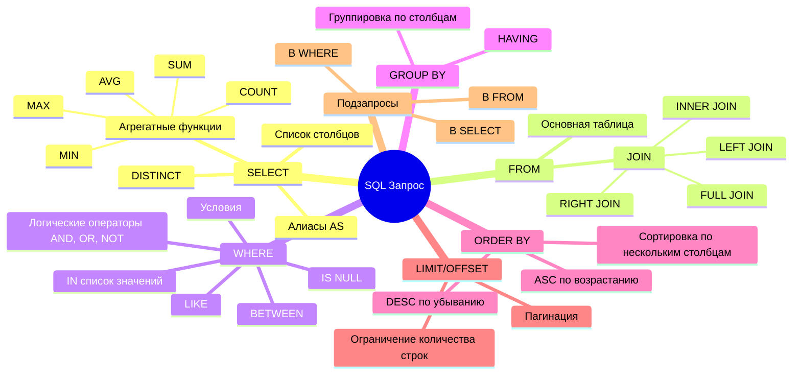
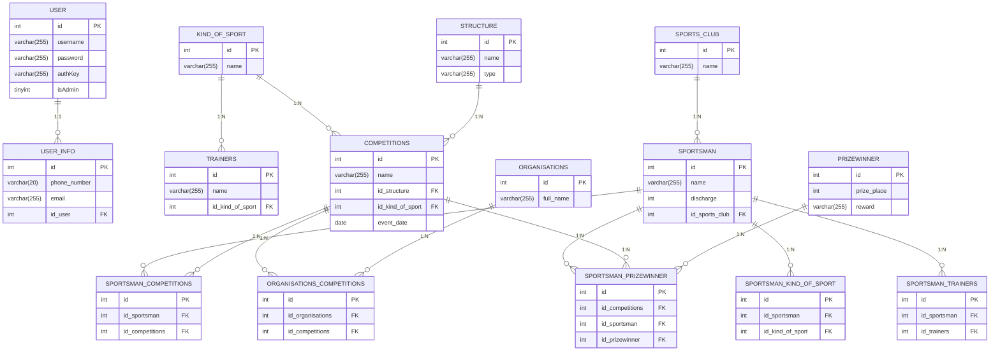
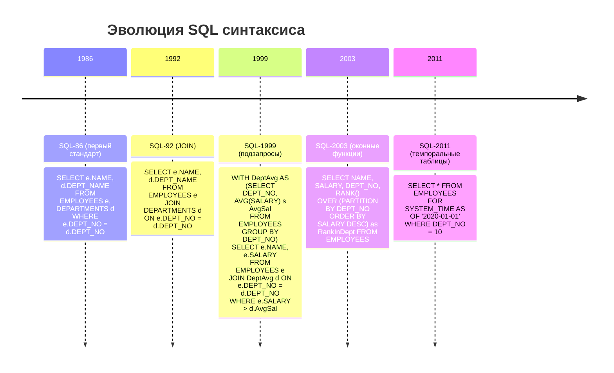

###

<!-- <div style="width: 100%; overflow: hidden; position: relative;">
  
</div> -->

<div style="width: 100%; overflow: hidden; position: relative;">
  
</div>

###

[](https://git.io/typing-svg)

#
<h4 align="left">I have knowledge of all major programming languages, including JS, Java, PHP, Python, and C++, if we talk specifically about PHP, I worked on a project based on Yii2, mysql, also developed a CRUD interface on Laravel + a frontend on Blade/React/Vue, also worked with Docker. I have basic knowledge of commands in the Linux & Windows console.</h4>

###


###

<h5 align="left">📚I have an idea of ​​the principles of OOP. I know and understand how SQL queries work.<br><br>✅I am in my last semester of university, pre-graduation practice.<br><br>🎊I would like to find my first commercial experience and work in a team.<br><br>🖥I will be glad to mutually beneficial cooperation.<br><br>🕰I am available for a conversation at any time.</h5>

###

<br>

#
<h3 align="center">Tech Stack</h3>

###

<div align="center">
  
  
  
  
  
  
  
  
  
</div>

###

#


###

<br>
<div align="center">
  
  
  
  
</div>

###

<br>
<br>
<div align="center">

# 💻Languages ​​and tools that I have worked with
 
 
 
 
 
 
 
 
 
 
 
 

</div>

###

<div align="right">
  
</div>

###

<div align="center">
  
  
</div>

###

<div align="left" style="width: 700px; margin: 0; padding: 0;">


```mermaid
mindmap
  root((SQL Запрос))
    SELECT
      Список столбцов
      DISTINCT
      Алиасы AS
      Агрегатные функции
        COUNT
        SUM
        AVG
        MIN
        MAX
    FROM
      Основная таблица
      JOIN
        INNER JOIN
        LEFT JOIN
        RIGHT JOIN
        FULL JOIN
    WHERE
      Условия
      Логические операторы AND, OR, NOT
      IN список значений
      BETWEEN
      LIKE
      IS NULL
    GROUP BY
      Группировка по столбцам
      HAVING
    ORDER BY
      ASC по возрастанию
      DESC по убыванию
      Сортировка по нескольким столбцам
    LIMIT/OFFSET
      Ограничение количества строк
      Пагинация
    Подзапросы
      В WHERE
      В FROM
      В SELECT
```
</div>

###

<div style="width: 100%; overflow: hidden; position: relative;">
  
</div>

###

<!-- 

<p align='left'>

```c++
#include <iostream>

using namespace std;
int main() {
    cout << "Hello World!" << endl;
    return 0;
}
```
</p> -->

<div align="center">


</div>


###

📌 **Сейчас работаю над:** [Веб-приложение спортивных организаций города](https://github.com/b221b/yii2)  


```mermaid
erDiagram
    USER ||--o{ USER_INFO : "1:1"
    USER {
        int id PK
        varchar(255) username
        varchar(255) password
        varchar(255) authKey
        tinyint isAdmin
    }
    
    USER_INFO {
        int id PK
        varchar(20) phone_number
        varchar(255) email
        int id_user FK
    }

    KIND_OF_SPORT ||--o{ TRAINERS : "1:N"
    KIND_OF_SPORT ||--o{ COMPETITIONS : "1:N"
    KIND_OF_SPORT {
        int id PK
        varchar(255) name
    }

    TRAINERS {
        int id PK
        varchar(255) name
        int id_kind_of_sport FK
    }

    SPORTS_CLUB ||--o{ SPORTSMAN : "1:N"
    SPORTS_CLUB {
        int id PK
        varchar(255) name
    }

    SPORTSMAN ||--o{ SPORTSMAN_KIND_OF_SPORT : "1:N"
    SPORTSMAN ||--o{ SPORTSMAN_TRAINERS : "1:N"
    SPORTSMAN ||--o{ SPORTSMAN_COMPETITIONS : "1:N"
    SPORTSMAN ||--o{ SPORTSMAN_PRIZEWINNER : "1:N"
    SPORTSMAN {
        int id PK
        varchar(255) name
        int discharge
        int id_sports_club FK
    }

    STRUCTURE ||--o{ COMPETITIONS : "1:N"
    STRUCTURE {
        int id PK
        varchar(255) name
        varchar(255) type
    }

    COMPETITIONS ||--o{ SPORTSMAN_COMPETITIONS : "1:N"
    COMPETITIONS ||--o{ ORGANISATIONS_COMPETITIONS : "1:N"
    COMPETITIONS ||--o{ SPORTSMAN_PRIZEWINNER : "1:N"
    COMPETITIONS {
        int id PK
        varchar(255) name
        int id_structure FK
        int id_kind_of_sport FK
        date event_date
    }

    ORGANISATIONS ||--o{ ORGANISATIONS_COMPETITIONS : "1:N"
    ORGANISATIONS {
        int id PK
        varchar(255) full_name
    }

    PRIZEWINNER ||--o{ SPORTSMAN_PRIZEWINNER : "1:N"
    PRIZEWINNER {
        int id PK
        int prize_place
        varchar(255) reward
    }

    SPORTSMAN_TRAINERS {
        int id PK
        int id_sportsman FK
        int id_trainers FK
    }

    SPORTSMAN_KIND_OF_SPORT {
        int id PK
        int id_sportsman FK
        int id_kind_of_sport FK
    }

    SPORTSMAN_COMPETITIONS {
        int id PK
        int id_sportsman FK
        int id_competitions FK
    }

    ORGANISATIONS_COMPETITIONS {
        int id PK
        int id_organisations FK
        int id_competitions FK
    }

    SPORTSMAN_PRIZEWINNER {
        int id PK
        int id_competitions FK
        int id_sportsman FK
        int id_prizewinner FK
    }
```


<br>

<div align="center">
  
</div>


###

## Example of "Hello World" in different languages

<div style="display: flex; flex-wrap: wrap; gap: 10px; margin-bottom: 20px;">

<details>
<summary></summary>

```python
print("Hello, World!")
```
</details>

<details>
<summary></summary>

```javascript
console.log("Hello, World!");
```
</details>

<details>
<summary></summary>

```java
public class Main {
    public static void main(String[] args) {
        System.out.println("Hello, World!");
    }
}
```
</details>

<details>
<summary></summary>

```csharp
using System;

class Program {
    static void Main() {
        Console.WriteLine("Hello, World!");
    }
}
```
</details>

<details>
<summary></summary>

```cpp
#include <iostream>

int main() {
    std::cout << "Hello, World!" << std::endl;
    return 0;
}
```
</details>

<details>
<summary></summary>

```go
package main

import "fmt"

func main() {
    fmt.Println("Hello, World!");
}
```
</details>

<details>
<summary></summary>

```ruby
puts "Hello, World!"
```
</details>

<details>
<summary></summary>

```rust
fn main() {
    println!("Hello, World!");
}
```
</details>

<details>
<summary></summary>

```swift
print("Hello, World!")
```
</details>

<details>
<summary></summary>

```kotlin
fun main() {
    println("Hello, World!")
}
```
</details>

<details>
<summary></summary>

```php
<?php
echo "Hello, World!";
?>
```
</details>

<details>
<summary></summary>

```typescript
console.log("Hello, World!");
```
</details>

<details>
<summary></summary>

```dart
void main() {
  print('Hello, World!');
}
```
</details>

</div>

###


```mermaid
timeline
    title Эволюция SQL синтаксиса

    1986 : SQL-86 (первый стандарт) : SELECT e.NAME, d.DEPT_NAME <br> FROM EMPLOYEES e, DEPARTMENTS d <br> WHERE e.DEPT_NO = d.DEPT_NO

    1992 : SQL-92 (JOIN) : SELECT e.NAME, d.DEPT_NAME <br> FROM EMPLOYEES e <br> JOIN DEPARTMENTS d ON e.DEPT_NO = d.DEPT_NO

    1999 : SQL-1999 (подзапросы) : WITH DeptAvg AS (SELECT DEPT_NO, AVG(SALARY) s AvgSal <br> FROM EMPLOYEES <br> GROUP BY DEPT_NO) <br> SELECT e.NAME, e.SALARY <br> FROM EMPLOYEES e <br> JOIN DeptAvg d ON e.DEPT_NO = d.DEPT_NO <br> WHERE e.SALARY > d.AvgSal

    2003 : SQL-2003 (оконные функции) : SELECT NAME, SALARY, DEPT_NO, RANK() <br> OVER (PARTITION BY DEPT_NO ORDER BY SALARY DESC) as RankInDept FROM EMPLOYEES

    2011 : SQL-2011 (темпоральные таблицы) : SELECT * FROM EMPLOYEES <br> FOR SYSTEM_TIME AS OF '2020-01-01' <br> WHERE DEPT_NO = 10
```

[https://github.com/b221b/yii2]: ссылка