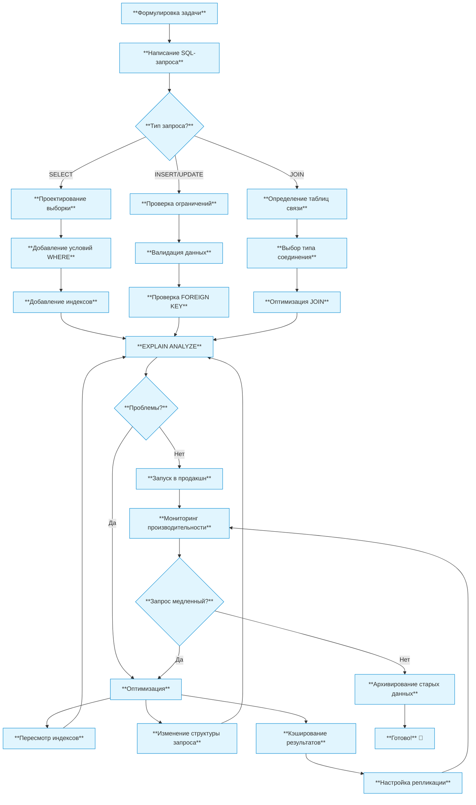
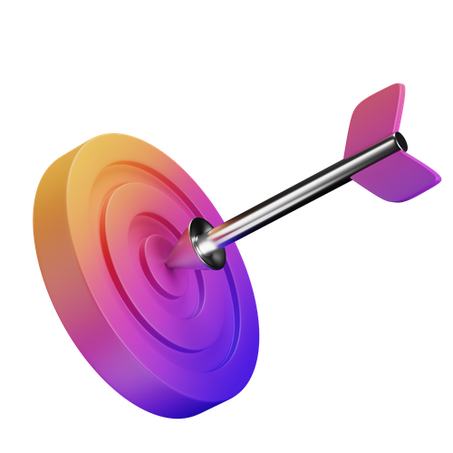
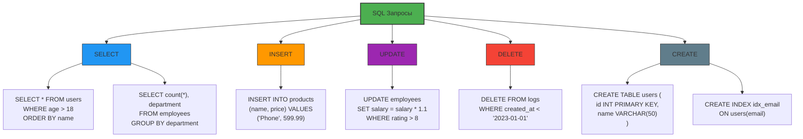
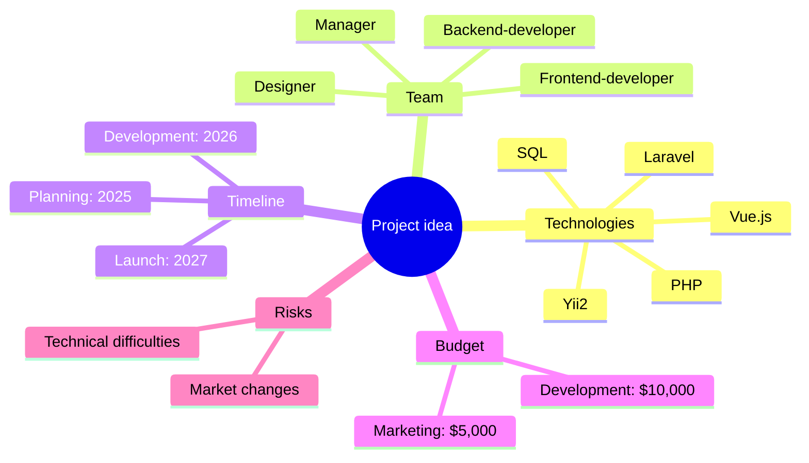
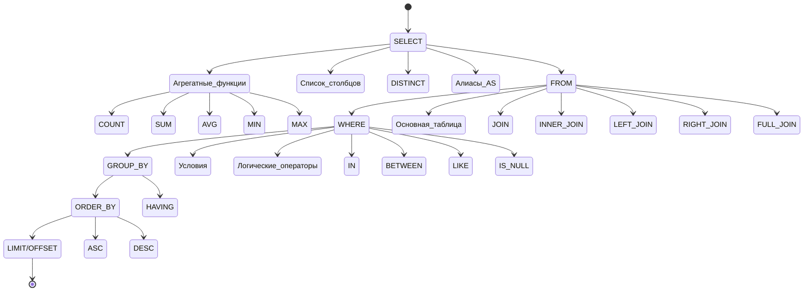
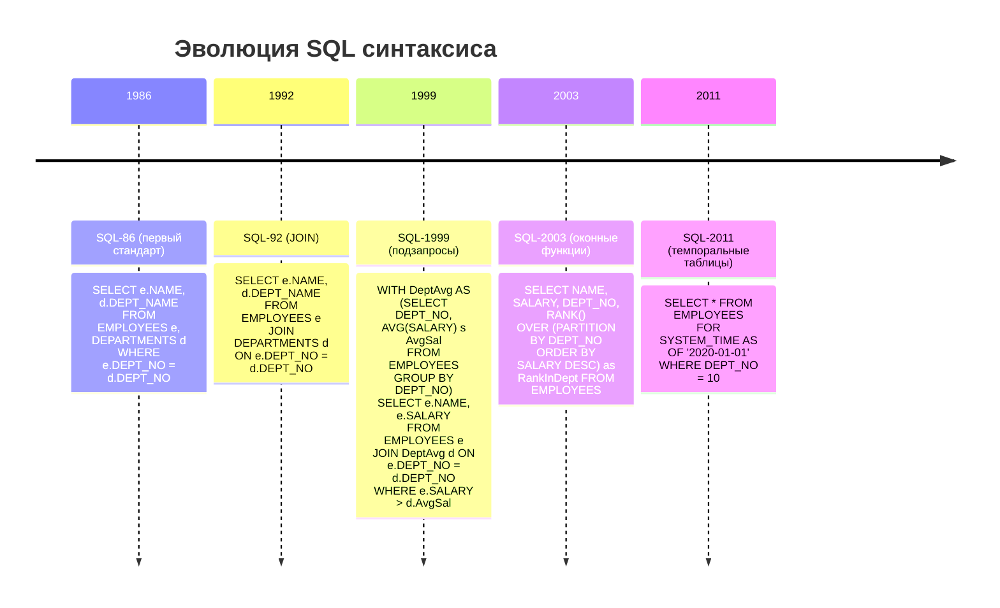

```mermaid
graph TD
    A[**Формулировка задачи**] --> B[**Написание SQL-запроса**]
    B --> C{**Тип запроса?**}
    C -->|SELECT| D[**Проектирование выборки**]
    C -->|INSERT/UPDATE| E[**Проверка ограничений**]
    C -->|JOIN| F[**Определение таблиц связи**]
    
    D --> G[**Добавление условий WHERE**]
    E --> H[**Валидация данных**]
    F --> I[**Выбор типа соединения**]
    
    G --> J[**Добавление индексов**]
    H --> K[**Проверка FOREIGN KEY**]
    I --> L[**Оптимизация JOIN**]
    
    J --> M[**EXPLAIN ANALYZE**]
    K --> M
    L --> M
    
    M --> N{**Проблемы?**}
    N -->|Нет| O[**Запуск в продакшн**]
    N -->|Да| P[**Оптимизация**]
    
    P --> Q[**Пересмотр индексов**]
    P --> R[**Изменение структуры запроса**]
    P --> S[**Кэширование результатов**]
    
    Q --> M
    R --> M
    S --> T[**Настройка репликации**]
    
    O --> U[**Мониторинг производительности**]
    T --> U
    U --> V{**Запрос медленный?**}
    V -->|Да| P
    V -->|Нет| W[**Архивирование старых данных**]
    
    W --> X[**Готово!** 🎯]
    
    style A fill:#E1F5FE,stroke:#0288D1
    style X fill:#E1F5FE,stroke:#0288D1
    style C fill:#E1F5FE,stroke:#0288D1
    classDef default fill:#E1F5FE,stroke:#0288D1,color:#333
```




###

<p align="left">

| Проект       | Описание          | Технологии   |
|--------------|-------------------|--------------|
| [Веб-приложение спортивных организаций города][https://github.com/b221b/yii2]| Веб-приложение на базе yii2, mysql, openserver      | PHP, YII2, MySQL |
| [API][https://github.com/b221b/yii2]| REST-сервис       | Go, Postgres |
| [API][https://github.com/b221b/yii2]| REST-сервис       | Go, Postgres |
| [API][https://github.com/b221b/yii2]| REST-сервис       | Go, Postgres |

</p>


```mermaid
flowchart TB
    A[SQL Запросы] --> B[SELECT]
    B --> B1["SELECT * FROM users\nWHERE age > 18\nORDER BY name"]
    B --> B2["SELECT count(*), department\nFROM employees\nGROUP BY department"]
    
    A --> C[INSERT]
    C --> C1["INSERT INTO products\n(name, price) VALUES\n('Phone', 599.99)"]
    
    A --> D[UPDATE]
    D --> D1["UPDATE employees\nSET salary = salary * 1.1\nWHERE rating > 8"]
    
    A --> E[DELETE]
    E --> E1["DELETE FROM logs\nWHERE created_at < '2023-01-01'"]
    
    A --> F[CREATE]
    F --> F1["CREATE TABLE users (\nid INT PRIMARY KEY,\nname VARCHAR(50)\n)"]
    F --> F2["CREATE INDEX idx_email\nON users(email)"]

    style A fill:#4CAF50,stroke:#333,stroke-width:2px
    style B fill:#2196F3,stroke:#333
    style C fill:#FF9800,stroke:#333
    style D fill:#9C27B0,stroke:#333
    style E fill:#F44336,stroke:#333
    style F fill:#607D8B,stroke:#333
```

<div style="position: relative;">
  
  <div style="position: absolute; top: 20px; left: 20px; background: rgba(0,0,0,0.7); padding: 10px; border-radius: 5px;">
    ```c++
    #include <iostream>

    using namespace std;
    int main() {
        cout << "Hello World!" << endl;
        return 0;
    }
    ```
</div>
</div>

<div align="center">
  <svg width="100%" height="2">
    <rect width="100%" height="4">
      <animate attributeName="fill" values="#ff0000;#00ff00;#0000ff;#ff00ff;#ffff00;#ff0000" dur="3s" repeatCount="indefinite"/>
    </rect>
  </svg>
</div>

<br>
<br>
<br>
<br>
<br>
<br>

<div style="width:100%; height:4px; background: linear-gradient(90deg, 
    #ff0000, #ff7f00, #ffff00, #00ff00, #0000ff, #4b0082, #9400d3, #ff0000); 
    background-size: 800% 100%; 
    animation: smoothRainbow 4s linear infinite;
    border-radius: 2px;"></div>

<style>
  @keyframes smoothRainbow {
    0% { background-position: 0% 50% }
    100% { background-position: 100% 50% }
  }
</style>

| Option 1 | Option 2 | Option 3 |
|-----------|-----------|-----------|
|  |  |  |

### ⚙️ Технические характеристики

-  **CPU**: Intel Core i5-12400F
-  **RAM**: 32GB DDR4 
-  **GPU**: NVIDIA RTX 3060Ti
-  **Apache**: 2.4.x
-  **PHP**: 8.0-8.1
-  **MySQL**: 8.1+

[](https://github.com/kittinan/spotify-github-profile)


## 🚀 Особенности
## 🔧 Установка
## 📄 Документация


```mermaid
mindmap
  root((Project idea))
    Technologies
      PHP
      Yii2
      Laravel
      SQL
      Vue.js
    Team
      Backend-developer
      Frontend-developer
      Designer
      Manager
    Timeline
      Planning: 2025
      Development: 2026
      Launch: 2027
    Budget
      Development: $10,000
      Marketing: $5,000
    Risks
      Technical difficulties
      Market changes
```


```mermaid
stateDiagram-v2
    [*] --> SELECT
    SELECT --> FROM
    SELECT --> Список_столбцов
    SELECT --> DISTINCT
    SELECT --> Алиасы_AS
    SELECT --> Агрегатные_функции
    Агрегатные_функции --> COUNT
    Агрегатные_функции --> SUM
    Агрегатные_функции --> AVG
    Агрегатные_функции --> MIN
    Агрегатные_функции --> MAX

    FROM --> WHERE
    FROM --> Основная_таблица
    FROM --> JOIN
    FROM --> INNER_JOIN
    FROM --> LEFT_JOIN
    FROM --> RIGHT_JOIN
    FROM --> FULL_JOIN

    WHERE --> GROUP_BY
    WHERE --> Условия
    WHERE --> Логические_операторы
    WHERE --> IN
    WHERE --> BETWEEN
    WHERE --> LIKE
    WHERE --> IS_NULL

    GROUP_BY --> ORDER_BY
    GROUP_BY --> HAVING

    ORDER_BY --> LIMIT/OFFSET
    ORDER_BY --> ASC
    ORDER_BY --> DESC

    LIMIT/OFFSET --> [*]
```

## Example of "Hello World" in different languages

<div style="align: center; display: flex; flex-wrap: wrap; gap: 30px; margin-bottom: 20px;">

<details>
<summary></summary>

```python
print("Hello, World!")
```
</details>

<details>
<summary></summary>

```javascript
console.log("Hello, World!");
```
</details>

<details>
<summary></summary>

```java
public class Main {
    public static void main(String[] args) {
        System.out.println("Hello, World!");
    }
}
```
</details>

<details>
<summary></summary>

```csharp
using System;

class Program {
    static void Main() {
        Console.WriteLine("Hello, World!");
    }
}
```
</details>

<details>
<summary></summary>

```cpp
#include <iostream>

int main() {
    std::cout << "Hello, World!" << std::endl;
    return 0;
}
```
</details>

<details>
<summary></summary>

```go
package main

import "fmt"

func main() {
    fmt.Println("Hello, World!");
}
```
</details>

<details>
<summary></summary>

```ruby
puts "Hello, World!"
```
</details>

<details>
<summary></summary>

```swift
print("Hello, World!")
```
</details>

<details>
<summary></summary>

```kotlin
fun main() {
    println("Hello, World!")
}
```
</details>

<details>
<summary></summary>

```php
<?php
echo "Hello, World!";
?>
```
</details>

<details>
<summary></summary>

```typescript
console.log("Hello, World!");
```
</details>

<details>
<summary></summary>

```dart
void main() {
  print('Hello, World!');
}
```
</details>

</div>

###


```mermaid
timeline
    title Эволюция SQL синтаксиса

    1986 : SQL-86 (первый стандарт) : SELECT e.NAME, d.DEPT_NAME <br> FROM EMPLOYEES e, DEPARTMENTS d <br> WHERE e.DEPT_NO = d.DEPT_NO

    1992 : SQL-92 (JOIN) : SELECT e.NAME, d.DEPT_NAME <br> FROM EMPLOYEES e <br> JOIN DEPARTMENTS d ON e.DEPT_NO = d.DEPT_NO

    1999 : SQL-1999 (подзапросы) : WITH DeptAvg AS (SELECT DEPT_NO, AVG(SALARY) s AvgSal <br> FROM EMPLOYEES <br> GROUP BY DEPT_NO) <br> SELECT e.NAME, e.SALARY <br> FROM EMPLOYEES e <br> JOIN DeptAvg d ON e.DEPT_NO = d.DEPT_NO <br> WHERE e.SALARY > d.AvgSal

    2003 : SQL-2003 (оконные функции) : SELECT NAME, SALARY, DEPT_NO, RANK() <br> OVER (PARTITION BY DEPT_NO ORDER BY SALARY DESC) as RankInDept FROM EMPLOYEES

    2011 : SQL-2011 (темпоральные таблицы) : SELECT * FROM EMPLOYEES <br> FOR SYSTEM_TIME AS OF '2020-01-01' <br> WHERE DEPT_NO = 10
```